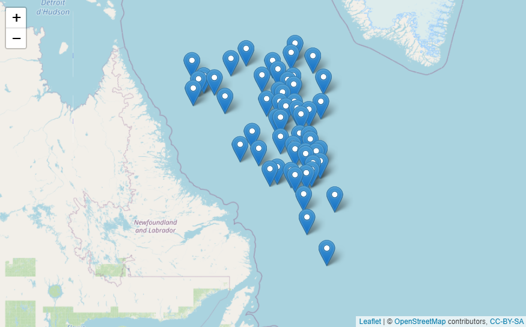

<!-- README.md is generated from README.Rmd. Please edit that file -->

# argodata

<!-- badges: start -->

[](https://www.tidyverse.org/lifecycle/#experimental)
[](https://github.com/ArgoCanada/argodata/actions)
[](https://codecov.io/gh/ArgoCanada/argodata?branch=master)
<!-- badges: end -->

The goal of argodata is to provide a data frame-based interface to data
generated by the [Argo floats program](https://argo.ucsd.edu/).

## Installation

You can install the development version from
[GitHub](https://github.com/) with:

``` r
# install.packages("remotes")
remotes::install_github("ArgoCanada/argodata")
```

The argodata package downloads files from the [FTP and HTTPS
mirrors](http://www.argodatamgt.org/Access-to-data/Access-via-FTP-or-HTTPS-on-GDAC),
caches them, and loads them into R. You can set the mirror using
`argo_set_mirror()` and the cache directory using
`argo_set_cache_dir()`:

``` r
argo_set_mirror("https://data-argo.ifremer.fr/")
argo_set_cache_dir("my/argo/cache")
```

Optionally, you can set `options(argodata.cache_dir = "my/argo/cache")`
in your .Rprofile to persist this value between R sessions (see
`usethis::edit_r_profile()`).

## Example

``` r
library(tidyverse)
library(argodata)

# search for profiles that match some criteria
(prof_ns_may_2020 <-  argo_global_prof() %>% 
  filter(
    latitude >= 50, latitude <= 60,
    longitude >= -60, longitude <= -50,
    lubridate::year(date) == 2020, 
    lubridate::month(date) == 5
  ))
#> # A tibble: 55 x 8
#>    file  date                latitude longitude ocean profiler_type institution
#>    <chr> <dttm>                 <dbl>     <dbl> <chr>         <dbl> <chr>      
#>  1 bodc~ 2020-05-05 16:48:52     56.9     -55.6 A               846 BO         
#>  2 bodc~ 2020-05-15 14:51:15     56.3     -55.2 A               846 BO         
#>  3 bodc~ 2020-05-25 16:41:59     55.6     -54.0 A               846 BO         
#>  4 bodc~ 2020-05-02 16:13:53     59.5     -51.6 A               846 BO         
#>  5 bodc~ 2020-05-12 17:51:58     59.7     -53.0 A               846 BO         
#>  6 bodc~ 2020-05-22 16:12:39     59.1     -53.9 A               846 BO         
#>  7 bodc~ 2020-05-04 01:44:23     59.4     -59.6 A               846 BO         
#>  8 bodc~ 2020-05-13 21:17:51     58.8     -58.1 A               846 BO         
#>  9 bodc~ 2020-05-23 16:30:46     58.2     -57.5 A               846 BO         
#> 10 cori~ 2020-05-04 07:14:14     58.0     -52.8 A               846 IF         
#> # ... with 45 more rows, and 1 more variable: date_update <dttm>

# downloads, caches, and reads the NetCDF files
(levels_ns_may_2020 <- prof_ns_may_2020 %>% 
  argo_prof_levels() )
#> # A tibble: 15,596 x 18
#>    float cycle_number date                 pres  psal  temp pres_qc psal_qc
#>    <chr>        <int> <dttm>              <dbl> <dbl> <dbl> <chr>   <chr>  
#>  1 bodc~          213 2020-05-05 16:48:51  4.20  34.8  3.45 1       1      
#>  2 bodc~          213 2020-05-05 16:48:51  9.80  34.8  3.45 1       1      
#>  3 bodc~          213 2020-05-05 16:48:51 15.3   34.8  3.45 1       1      
#>  4 bodc~          213 2020-05-05 16:48:51 20     34.8  3.45 1       1      
#>  5 bodc~          213 2020-05-05 16:48:51 25     34.8  3.44 1       1      
#>  6 bodc~          213 2020-05-05 16:48:51 29.8   34.8  3.44 1       1      
#>  7 bodc~          213 2020-05-05 16:48:51 34.7   34.8  3.45 1       1      
#>  8 bodc~          213 2020-05-05 16:48:51 40.2   34.8  3.44 1       1      
#>  9 bodc~          213 2020-05-05 16:48:51 50.1   34.8  3.43 1       1      
#> 10 bodc~          213 2020-05-05 16:48:51 59.4   34.8  3.43 1       1      
#> # ... with 15,586 more rows, and 10 more variables: temp_qc <chr>,
#> #   pres_adjusted <dbl>, psal_adjusted <dbl>, temp_adjusted <dbl>,
#> #   pres_adjusted_qc <chr>, psal_adjusted_qc <chr>, temp_adjusted_qc <chr>,
#> #   pres_adjusted_error <dbl>, psal_adjusted_error <dbl>,
#> #   temp_adjusted_error <dbl>

# plot!
levels_ns_may_2020 %>% 
  filter(psal_qc == 1) %>% 
  ggplot(aes(x = psal, y = pres, col = temp)) +
  geom_point() +
  scale_y_reverse() +
  theme_bw()
```


In RStudio, you can use the
[leaflet](https://rstudio.github.io/leaflet/) package to view locations
of profiles interactively.

``` r
library(leaflet)

prof_ns_may_2020 %>% 
  leaflet() %>% 
  addTiles() %>% 
  addMarkers(lng = ~longitude, lat = ~latitude, label = ~file)
```


