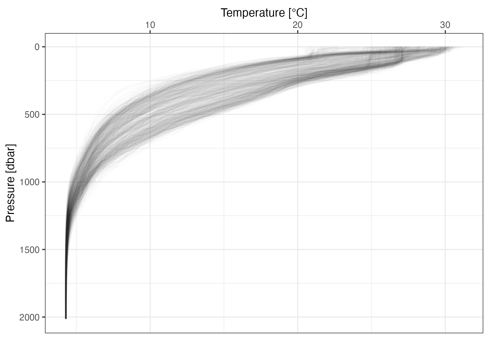
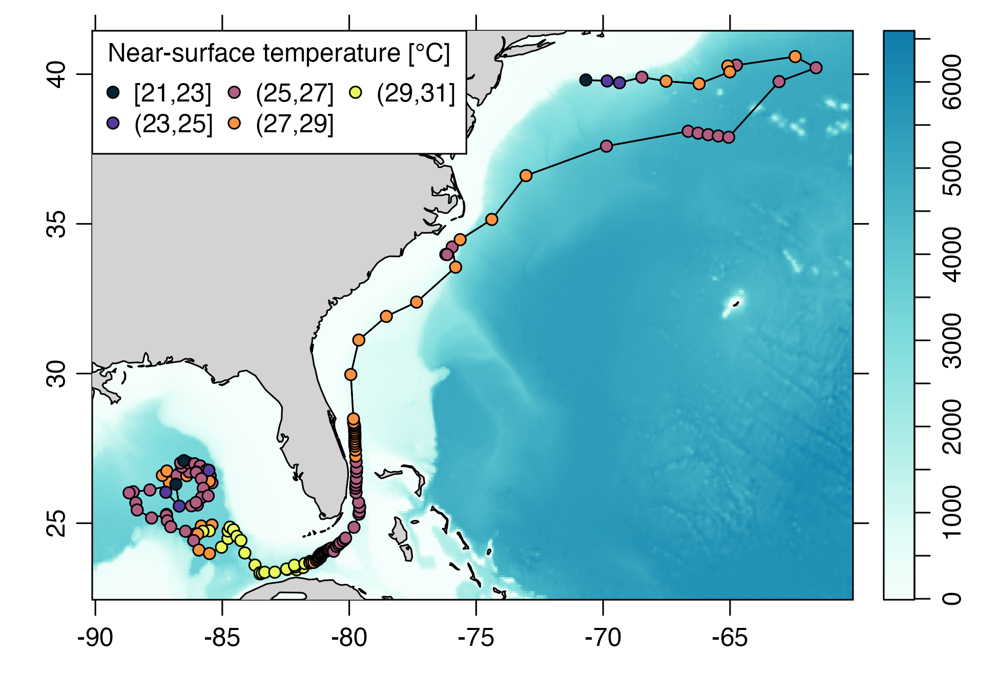

# Summary

This paper describes ``argodata``, an R package that makes it easier to work with data acquired in the International Argo Program, which provides over two decades of oceanographic measurements from around the world. Although Argo data are publicly available in NetCDF format and several software packages are available to assist in locating and downloading relevant Argo data, the multidimensional arrays used can be difficult to understand for non-oceanographers, particulary for the expanding arrays of biogeochemical variables measured by Argo floats. Given the increasing use of Argo data in other disciplines, we built a minimal interface to the data set that uses the data frame as the primary data structure. This approach allows users to leverage the rich ecosystem of R packages that manipulate data frames (e.g., the ``tidyverse``) and associated instructional resources.

# Introduction

The ocean is highly variable in both space and time and mapping this variability at appropriate scales is a key factor in many scientific studies. Oceanographic data have direct applications that range from the analysis of near-bottom ecosystems to air-sea interactions.  More broadly, ocean measurements are needed to constrain the models that scientists use to understand the evolving state of the ocean and to make predictions about its future, particularly as a component of the global climate system.

The International Argo Program [@argo] deploys and collects data from several thousand devices that are programmed to drift with and move vertically through the ocean. Sensors measure electrical conductivity, temperature, pressure, and other quantities along this vertical path yielding "profiles" that are uploaded via satellite to globally distributed data assembly centres [@roemmich_argo_2001; @roemmich_argo_2009-2]. Since 1997, the International Argo Program has collected over 2.4 million profiles from around the globe and expanded its original array of sensors to measure biogeochemicical variables such as pH, chloryphyll-α, dissolved oxygen, nitrate, and many others.

Although the NetCDF data files provided by Argo data servers contain metadata that describe their contents, we identified a number of barriers to data access. These included (1) reading and decoding the index files to locate files of interest, (2) downloading and potentially caching large numbers of small NetCDF files, (3) reading the NetCDF files into a form where the data contained within can be visualized and analyzed, and (4) dealing efficiently with potentially large Argo data sets. In particular, the incorporation of biogeochemical variables in Argo NetCDF files introduced additional complexity such that a novice- to average-level programmer may have difficulty extracting and manipulating data from many profiles. Whereas a variety of applications have been created to address some of these barriers, the ``argodata`` package is our attempt to overcome these barriers for the novice- to average-level programmer who may not be familiar with oceanographic conventions for storing data.

# Statement of need

In the R language, several tools are available to access data from the International Argo Program. The ``oce`` package provides facilities to read and analyze "profile" and "trajectory" Argo NetCDF files [@kelley_oceanographic_2018; @r-oce]; the ``argoFloats`` package provides additional tools to locate, download, cache, and visualize Argo NetCDF files [@kelley_argofloats_2021]; and ``rnoaa`` provides limited access to a subset of Argo data from the North Atlantic [@r-rnoaa]. Outside of R, the ``argopy`` package for Python provides access to the Argo data set with some facilities for analysis and visualization [@maze_argopy_2020], and several web applications provide visual tools to locate relevant Argo profiles based on user-defined search criteria [@oceanops_oceanops_2021; @tucker_argovis_2020].

Several barriers we identified are not specific to the Argo data set and can be overcome with well-established R tools. To download and potentially cache Argo NetCDF files, at least one Argo mirror provides an `rsync` target for profile and index files. The ``bowerbird`` package provides similar facilities for downloading and caching large numbers of files from a remote source [@r-bowerbird]. To analyze and visualize potentially large data sets, ``dplyr`` and ``ggplot2`` within the wider ``tidyverse`` family of packages are well-established [@r-ggplot2; @r-dplyr; @r-tidyverse]. To read NetCDF files in a form that can be analyzed and plotted using ``dplyr`` and ``ggplot2``, respectively, the ``tidync`` and ``ncmeta`` packages introduce the concept of "grids" to identify groups of variables that can be loaded into a single data frame [@r-ncmeta; @r-tidync]. 

The ``argodata`` package was designed to work with a range of tools that manipulate R data frames. In particular, the ``tidyverse`` family of packages has a large user base and has widely and freely available educational material in several languages [@wickham_grolemund17]. Whereas previous packages for R and Python propagate the multidimensional array format of Argo NetCDF files when read, the ability to leverage the ``tidyverse`` depends on the representation of Argo data as data frames in  "tidy" (one observation per row, one variable per column) format [@wickham14], around which packages in the ``tidyverse`` are designed.

# Using ``argodata``

The ``argodata`` package is available as an R source package from GitHub (<https://github.com/ArgoCanada/argodata>), installable using the ``remotes`` package:

``` r
# install.packages("remotes")
remotes::install_github("ArgoCanada/argodata")
```

For our example usage, we also load the ``tidyverse``:


```r
library(tidyverse)
library(argodata)
```

To locate files of interest on the Argo mirror, index files for profile, trajectory, meta, and technical parameter files are provided in compressed CSV format. ``argodata`` uses the ``vroom`` package  to efficiently load these files as they can be time-consuming to repeatedly read otherwise. The most commonly-used index is for profile files:


```r
(prof <- argo_global_prof())
```

```
## Loading argo_global_prof()
```

```
## Downloading 1 file from 'https://data-argo.ifremer.fr'
```

```
## # A tibble: 2,524,364 x 8
##    file     date                latitude longitude ocean profiler_type
##    <chr>    <dttm>                 <dbl>     <dbl> <chr>         <dbl>
##  1 aoml/13~ 1997-07-29 20:03:00    0.267     -16.0 A               845
##  2 aoml/13~ 1997-08-09 19:21:12    0.072     -17.7 A               845
##  3 aoml/13~ 1997-08-20 18:45:45    0.543     -19.6 A               845
##  4 aoml/13~ 1997-08-31 19:39:05    1.26      -20.5 A               845
##  5 aoml/13~ 1997-09-11 18:58:08    0.72      -20.8 A               845
##  6 aoml/13~ 1997-09-22 19:57:02    1.76      -21.6 A               845
##  7 aoml/13~ 1997-10-03 19:15:49    2.60      -21.6 A               845
##  8 aoml/13~ 1997-10-14 18:39:35    1.76      -21.6 A               845
##  9 aoml/13~ 1997-10-25 19:32:34    1.80      -21.8 A               845
## 10 aoml/13~ 1997-11-05 18:51:42    1.64      -21.4 A               845
## # ... with 2,524,354 more rows, and 2 more variables:
## #   institution <chr>, date_update <dttm>
```

A typical analysis will focus on a subset of profiles. Users can subset this index using existing knowledge of data frames in R; however, some common subsets are verbose using existing tools or difficult to compute without knowing Argo-specific filename conventions. To match the syntax of `dplyr::filter()`, ``argodata`` provides several `argo_filter_*()` functions to subset index data frames:


```r
prof_gulf_stream_2020 <- prof %>% 
  argo_filter_radius(latitude = 26, longitude = -84, radius = 500) %>%
  argo_filter_date("2020-01-01", "2020-12-31") %>%
  argo_filter_data_mode("delayed")
```

The next step is to download the selected files. The explicit call to `argo_download()` is typically omitted as it is done automatically for missing files by the load functions described below; however, one can manually call `argo_download()` to download (if necessary) and cache files in an index. To facilitate use of alternative cache solutions like `rsync` or ``bowerbird`` [@r-bowerbird], we use the same file structure as the mirror itself and provide `argo_set_cache_dir()` to allow this directory to be used for all calls to `argo_download()`.

To load data from NetCDF files into meaningful data frames we draw from the concept of "grids" introduced by the ``tidync`` and ``ncmeta`` packages [@r-ncmeta; @r-tidync]. For example, temperature values stored in an Argo profile NetCDF file are identified by values of `N_PROF` (an integer identifying a profile within an Argo NetCDF file) and `N_LEVEL` (an integer identifying a sampling level within a profile). Temperature values can be represented by a matrix with one row per `N_LEVELS` and one column per `N_PROF` or by a data frame with variables `N_PROF`, `N_LEVELS`, and `TEMP`. Any other variables that share the dimensions of the temperature variable can be added as additional columns in the data frame. After looping through each file in a complete copy of the Argo data set, we identified 19 grids among four Argo NetCDF file formats (profile, trajectory, metadata, and technical information) [@argo-user-manual]. The most commonly-used grid is the levels grid for Argo profile files:


```r
(levels <- prof_gulf_stream_2020 %>% 
  argo_prof_levels())
```

```
## Downloading 757 files from 'https://data-argo.ifremer.fr'
```

```
## Extracting from 757 files
```

```
## # A tibble: 1,473,130 x 18
##    file   n_levels n_prof  pres pres_qc pres_adjusted pres_adjusted_qc
##    <chr>     <int>  <int> <dbl> <chr>           <dbl> <chr>           
##  1 aoml/~        1      1  1.12 1                1.12 1               
##  2 aoml/~        2      1  2    1                2    1               
##  3 aoml/~        3      1  3    1                3    1               
##  4 aoml/~        4      1  4    1                4    1               
##  5 aoml/~        5      1  4.96 1                4.96 1               
##  6 aoml/~        6      1  6    1                6    1               
##  7 aoml/~        7      1  7    1                7    1               
##  8 aoml/~        8      1  7.92 1                7.92 1               
##  9 aoml/~        9      1  9    1                9    1               
## 10 aoml/~       10      1 10    1               10    1               
## # ... with 1,473,120 more rows, and 11 more variables:
## #   pres_adjusted_error <dbl>, temp <dbl>, temp_qc <chr>,
## #   temp_adjusted <dbl>, temp_adjusted_qc <chr>,
## #   temp_adjusted_error <dbl>, psal <dbl>, psal_qc <chr>,
## #   psal_adjusted <dbl>, psal_adjusted_qc <chr>,
## #   psal_adjusted_error <dbl>
```

Like `argo_prof_levels()`, other extraction functions use the pattern `argo_{file type}_{grid}()` and use a split-apply-combine strategy that row-binds the results obtained by reading each file individually [@wickham11]. To facilitate users who prefer to manage their own collection of Argo files, corresponding `argo_read_{file type}_{grid}()` functions that read a single file are also exported. Extraction functions are designed to return useful inputs to ``dplyr`` and ``ggplot2``. For example, a common way to visualize profile data is to plot a dependent variable (e.g., temperature) against pressure (as a proxy for depth), with pressure oriented vertically to simulate its orientation in space.


```r
ggplot(levels, aes(x = temp, y = pres)) +
  geom_line(aes(group = file), alpha = 0.01, orientation = "y") +
  scale_y_reverse() +
  scale_x_continuous(position = "top") +
  theme_bw() +
  labs(
    x = "Temperature [°C]",
    y = "Pressure [dbar]"
  )
```

<!-- --> 

# Interoperability

The ``argodata`` package was designed to interoperate with the ``argoFloats`` and ``oce`` packages for users who prefer to do part of their analyses using the facilities provided by these packages. In particular, these packages provide specialized functions for mapping and oceanographic analysis that are outside the scope of ``argodata``. For example, one can combine the trajectory plotting capability of ``argoFloats`` with a ``dplyr`` `group_by()` and `summarise()` enabled by ``argodata`` and visualized using colour palettes from ``cmocean`` [@r-cmocean].


```r
library(argoFloats)

# use argoFloats to locate profiles
index <- getIndex() %>% subset(ID = 4903252)

# calculate mean surface temperature using argodata
temp_calc <- index %>% 
  argo_prof_levels() %>% 
  filter(pres < 10) %>% 
  group_by(file) %>%
  summarise(
    near_surface_temp = mean(temp, na.rm = TRUE)
  ) %>%
  mutate(
    near_surface_temp_bin = cut_width(near_surface_temp, width = 2)
  ) %>% 
  left_join(argo_global_prof(), by = "file")

# use plot method for argoFloats index and add temperatures
par(mar = c(3, 3, 1, 2))
plot(index, which = "map", type = "l")

# plot temperatures
palette(cmocean::cmocean("thermal")(5))
points(
  temp_calc$longitude, temp_calc$latitude,
  bg = temp_calc$near_surface_temp_bin, pch = 21, cex = 1
)

legend(
  "topleft",
  levels(temp_calc$near_surface_temp_bin), pt.bg = palette(), pch = 21,
  title = "Near-surface temperature [°C]", ncol = 3
)
```

<!-- --> 

# Conclusion

The ``argodata`` package helps scientists analyze data from the International Argo Program using a minimal table-based interface. We hope that ``argodata`` will expand the audience of Argo data to users already familiar with data frame manipulation tools such as those provided by the ``tidyverse`` family of packages.

# Acknowledgements

We acknowledge useful discussions with Chris Gordon, especially regarding the extraction of quality control information from Argo data files. We thank the editors and reviewers for their thoughtful and careful review of this manuscript. Support for this work came from the Natural Sciences and Engineering Research Council of Canada and G7 Charlevoix Blueprint for Healthy Oceans, Seas and Resilient Coastal Communities. The data used in this paper were collected and made freely available by the International Argo Program and the national programs that contribute to it (<https://argo.ucsd.edu>, <https://www.ocean-ops.org>). The Argo Program [@argo] is part of the Global Ocean Observing System.

# References
